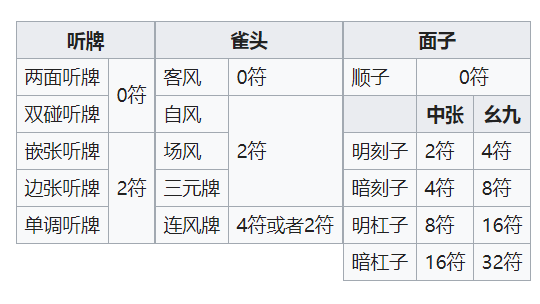

## 引言
前段时间跟朋友线下打麻将时候遇到的最大的一个问题——算点数。

日麻不同于国标（以及国内许多地方麻将）只需要算番数（或分数、台数等），它需要由**符**和**翻**来计算出最终获得的**点数**。

例如：一筒二筒发发发中中，自摸三筒，副露八筒小明杠(碰对家)、九万明刻(碰下家)。（简记12p66677z自摸3p副露88=88p,999+m）

这手牌的符为符底 20 + 九万明刻 4 + 发暗刻 8 + 八筒明杠 8 + 雀头中 2 + 自摸 2 = 46 符 ≒ 50 符。

翻则只有役牌发的1翻。基本点为 50*2^(2+1) = 400 点。如果是庄家，点数为 800ALL = 2400 点；闲家则为 400 / 800 = 1600 点。

打日麻的人基本上都会算翻（亦作飜/番，由手牌组成的役种决定），因为日麻和牌的基本是役。而因为身边的人大多是电子游戏入门，对于实麻中涉及到的计算问题就比较生疏。虽然说有早见表（[→中文维基百科](https://zh.wikipedia.org/wiki/%E6%97%A5%E6%9C%AC%E9%BA%BB%E5%B0%87%E8%A8%88%E5%88%86%E6%96%B9%E6%B3%95#%E5%BE%97%E5%88%86%E9%80%9F%E6%9F%A5%E8%A1%A8)），但是算符也够呛的（拆解牌型很容易搞混符数）。下图是适用于4面子1雀头的标准拆解表。



因为确认面子→雀头→听牌形式，判断门前加符和自摸加符这个过程很简单，最近又在看 React，于是打算做一个 React App 来完成从**「拆解好的手牌形式」**和「翻数」来计算点数的程序。

由于兼带了 React 入门，所以目前只能够实现从**「符数」**和翻数来计算点数，并列出全部四种分配形式。~~（而且还没有做界面美化）~~

## React 开发环境

最简单地，什么工具都不装，在一个 HTML 文件里引入 react 所需的几个库，就可以开始编写了，但是缺少开发工具不便于后期 release，我这里使用了 Intellij IDEA 来创建 React App。（和 WebStorm 使用方法一致，需要安装 Node.js）

首次创建项目会自动安装 React 官方脚手架，时间较长需要耐心等待。```npm install -g create-react-app``` 

正常安装后执行 ```npm start```，会编译输出项目并运行本地服务器在```localhost:3000```，正常打开的话就可以去修改```App.js```写自己的项目啦。

## 