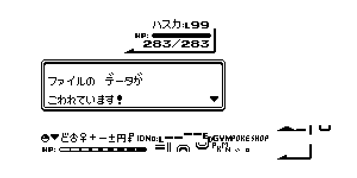
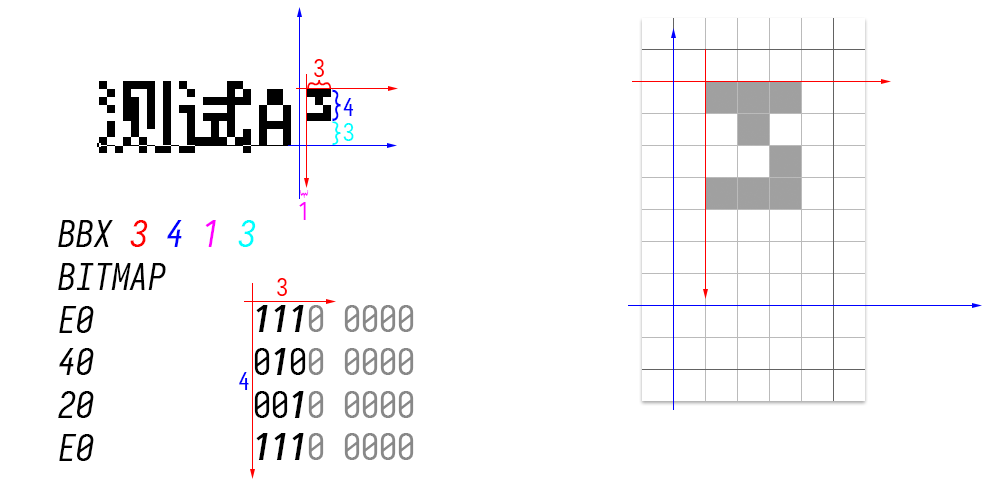

## 前言

※前言中废话比较多，没兴趣的可以略过。

在油管上看宝可梦视频的时候，发现许多制作者的解说字幕中都用到了点阵风格的字体，比如基于宝可梦第一、第二世代制作的免费字体 [ポケモンフォント](https://nue2004.info/program/pkmn/)。

使用例：



我也觉得点阵字体很适合用作热敏纸打印机（单色，低清）的打印字体，能在小尺寸的同时做到美观和易读。

<!-- more -->

在玩宝可梦第三、第四世代的时候我发现游戏中的点阵字体也很美观，想要制作一个类似的字体。做来干嘛？当然是玩儿……

### 前言2

此前使用 [M+ BITMAP FONT](http://mplus-fonts.osdn.jp/mplus-bitmap-fonts/index.html) 中的等幅欧文字型 `mplus_f12r.bdf` 替换 [俐方体11号](https://github.com/ACh-K/Cubic-11) 中可变幅英数时发现BDF字体格式既方便应用程序读取解析编辑（虽然Windows下的编辑器几乎没有），也方便使用者直接对其阅读和修改。

当时参考了这篇文章：[中文像素字体制作](https://ldt.indienova.com/u/hata/blogread/26923)（来自 indienova.com）

然后就是全网瞎几把搜“如何制作点阵字体”，刨去无用的内容之后剩下的东西不多，经过乱七八糟的阅读之后结论：无论是从头制作点阵字体还是从现成的字模转换，都是从点阵本身出发，再转换为TrueType的矢量图形会比较方便。

既然要转换的话，源文件是什么格式都无所谓了，最笨的办法大概就是直接去游戏里截图做成位图然后用Python脚本读取转换。

## 提取TTF内嵌点阵并转换为独立的TTF

其实说实话，跟 [中文像素字体制作](https://ldt.indienova.com/u/hata/blogread/26923) 里实现的东西大差不差，甚至还比他少一步合并的过程。主要是对其中脚本进行了一个bug的修复和功能的扩展。

### 获取BDF

这里使用了 Zfull-GB 字体文件中内嵌的10px像素点阵（中文部分实际为9×9。顺带一提这个字体的12px像素点阵很好看）

BDF文件的提取方法参考自：[使用FontForge提取和嵌入TTF字体中的点阵字体](https://jingyan.baidu.com/article/3ea51489c092d852e61bbae0.html) 的STEP1~9。

用[FontForge](http://fontforge.github.io/en-US/)打开TTF文件，会提示是否加载内嵌点阵字体，选择需要的字体打开。
打开后选择[File]→[Generate Fonts...]，文件名下方两个下拉框依次选择`No Outline Font`和`BDF`，输入需要的字体尺寸导出就得到了单独的点阵字体BDF文件。

### 转换点阵字体为矢量字体

一上来当然是直接照抄 [中文像素字体制作](https://ldt.indienova.com/u/hata/blogread/26923) 中的Python脚本，发现它第一行的x坐标值设歪了……怪不得预览图中的字体看着不对劲。

在准备好FontForge和bdflib支持后直接跳到这篇文章的第3步，新建一个`bdf_to_sfd.py`<sup>（原文有拼写错误xsk）</sup>

然后我就为了调整字体的基线位置、基线上高度、基线下高度、字宽断断续续花了两天去阅读语法说明和API文档。

#### 需要了解的知识和文档

##### 首先是EM Square

[FontForge与字体设计：EM Square](http://designwithfontforge.com/zh-CN/The_EM_Square.html)

其中，“x高度”与本文无关，只需要理解“基线”的存在，相当于我们在笔记本上写字时的那条线，大多数文字都写在这条线**上**，有一些字符则是“跨在这条线上”。

到字体文件的metadata<sup>（不知道是否可以这么说但差不多就是这个意思）</sup>里，就需要设置基线上高度(Font Ascent)、基线下高度(Font Descent)。

##### BDF文件的结构

有高就有宽。高度是字体的属性而宽度是字模(Glyph)的属性。

比如定义一个高10px的字体，其中全体汉字的宽度为10，全体半角字符的宽度为5。

但，不是所有字符都占满了这一个5×10的格子的，比如标点符号`,.!` 上标`²³`等。对于这种字符，在BDF中可以只描述有图像的部分，并使用FOUNDINGBOX的语法来描述图像相对于原点（**位于基线上**）的偏移。**正方向为x轴向右y轴向上。**

关于BDF语法结构，只找到一篇用中文描述的：[BDF 字体文件格式(转)](https://blog.csdn.net/ppxmeng/article/details/5883677)

在本文中需要关注的内容有：

```
字体定义部分
PIXEL_SIZE 10   //像素尺寸为10
FONT_ASCENT 8   //基线上高度为8
FONT_DESCENT 2  //基线下高度为2

字体定义和字模定义均可设置
DWIDTH 10 0     //下一字符原点至当前字符原点的距离。
                //比如10 0 代表下一字符出现在
                //当前字符右侧10px，上方0px。
BBX 5 5 0 1     //字模的宽、高、x轴偏移、y轴偏移。
                //四个参数依次称为bbW,bbH,bbX,bbY

字模定义部分
BITMAP          //声明下一行起为该字模的图像。
                //图像由16进制描述，转为2进制就是图像本图啦。
```

这里搞清楚原点位置花了我好久，以³为例。
```
STARTCHAR uni00B3
ENCODING 179
SWIDTH 500 0
DWIDTH 5 0
SWIDTH1 1000 0
BBX 3 4 1 3
BITMAP
E0
40
20
E0
ENDCHAR
```
前文提过，坐标轴的方向为x轴向右y轴向上，bbX和bbY遵循这个坐标系。

但是，BITMAP下面的图像部分参照自然书写顺序，也就是从左往右，**从上到下**的。bbW和bbH遵循这个顺序。画成示意图像下面这样。



顺带一提在bdflib解析后，`__str__()`函数返回的图像长下面这样。

```
|###
|.#.
|..#
|###
|...
|...
+---
```

可以看到它已经囊括了bbX和bbY的信息。其中bbX就不需要再次使用了，而为了实现从上到下的绘制，还是需要进行一个实际高度的获取，即`bbH+bbY`的值。

（其实直接去算这个字符串有多少行也行……）

### 修改后的脚本文件

```python
from bdflib import reader
import fontforge


def OpenBDF(path):
    with open(path, "rb") as handle:
        return reader.read_bdf(handle)


def Start():
    bdf_font = OpenBDF(r"Zfull-GB-10.bdf")  # 手动设定
    sfd_font = fontforge.font()
    sfd_font.encoding = "unicode"  # 手动指定
    sfd_font.ascent = bdf_font.properties[b'FONT_ASCENT']*100
    sfd_font.descent = bdf_font.properties[b'FONT_DESCENT']*100
    print(bdf_font.properties)
    for bdf_glyph in bdf_font.glyphs:
        x = 0
        y = bdf_glyph.bbH + bdf_glyph.bbY - 1
        #print(bdf_glyph.codepoint)
        glyph = sfd_font.createMappedChar(bdf_glyph.codepoint)
        if bdf_glyph.advance > 0:
            w = bdf_glyph.advance * 100
        else:
            w = 1000  # 不知为何获取不到全局定义，故手动指定
        vw = bdf_glyph.bbH * 100
        pen = glyph.glyphPen()
        for ch in bdf_glyph.__str__():
            if ch == '\n':
                y = y - 1
                x = -1
                #print("")
            elif ch == '#':
                pen.moveTo((100 * x, 100 * y))
                pen.lineTo((100 * x, 100 * y + 100))
                pen.lineTo((100 * x + 100, 100 * y + 100))
                pen.lineTo((100 * x + 100, 100 * y))
                pen.closePath()
                #print("#", end="")
            else:
                #print(".", end="")
            x = x + 1
        pen = None
        #print()
        glyph.width = w  # 在绘制完后指定才有效
        glyph.vwidth = vw  # 在绘制完后指定才有效
        glyph.removeOverlap()

    # sdf_font.autoWidth()
    sfd_font.save(r"converted.sfd")  # 手动设定


Start()

```

## 尾声
导出完检查了几个字模确认这回宽高边距什么都没问题就导出TTF了，结果今天发现空格的字模消失了导致空格变成了方框wwwwwwwww

接下来当然是继续折腾宝可梦字体啦。虽然没什么进展但是找到了可以参考的项目。

感谢您的阅读。

## 文中未提及的参考资料以及有用的网站

[bdflib API Reference](https://bdflib.readthedocs.io/en/stable/reference.html)

[fontforge Python Scripting 文档](https://fontforge.org/docs/scripting/python/fontforge.html)

[FontForge 与字体设计](http://designwithfontforge.com/zh-CN/)

[Unicode 字符百科](https://unicode-table.com/cn/)

[如何将点阵汉字矢量化](https://zhuanlan.zhihu.com/p/23405248)（本文未参考）